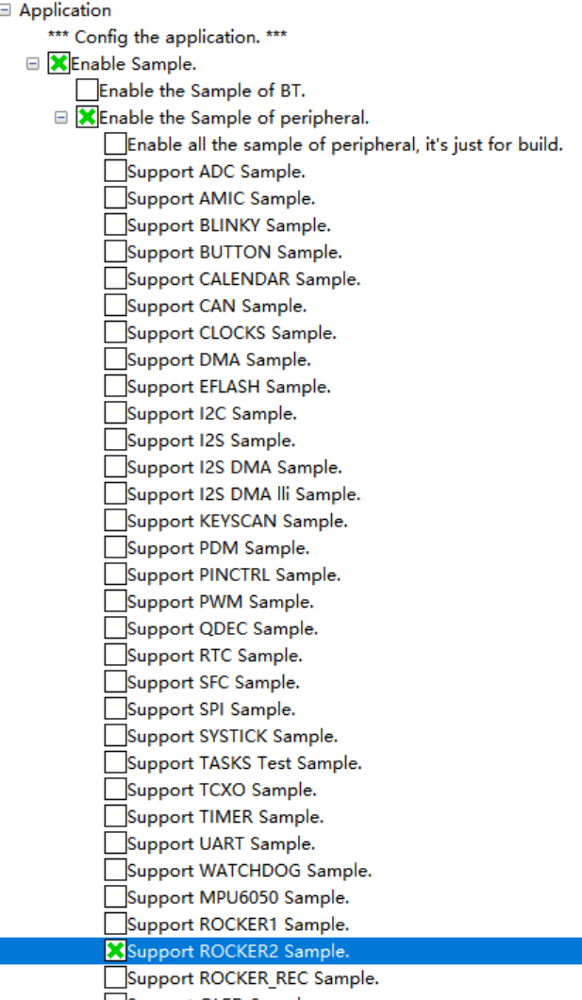

左摇杆代码在：\\src\application\samples\peripheral\rocker1
右摇杆代码在：\src\application\samples\peripheral\rocker2
服务器代码在：\\src\application\samples\peripheral\rocker_rec

## **编译方法：**

* 系统Windows11/10
* 软件：HiSpark Studio
* 环境：python311

1. 选择软件内“系统配置”

   

2.勾选需要编译的代码，注意不编译的不要勾选

3.保存配置，点击“重编译/编译”即可
